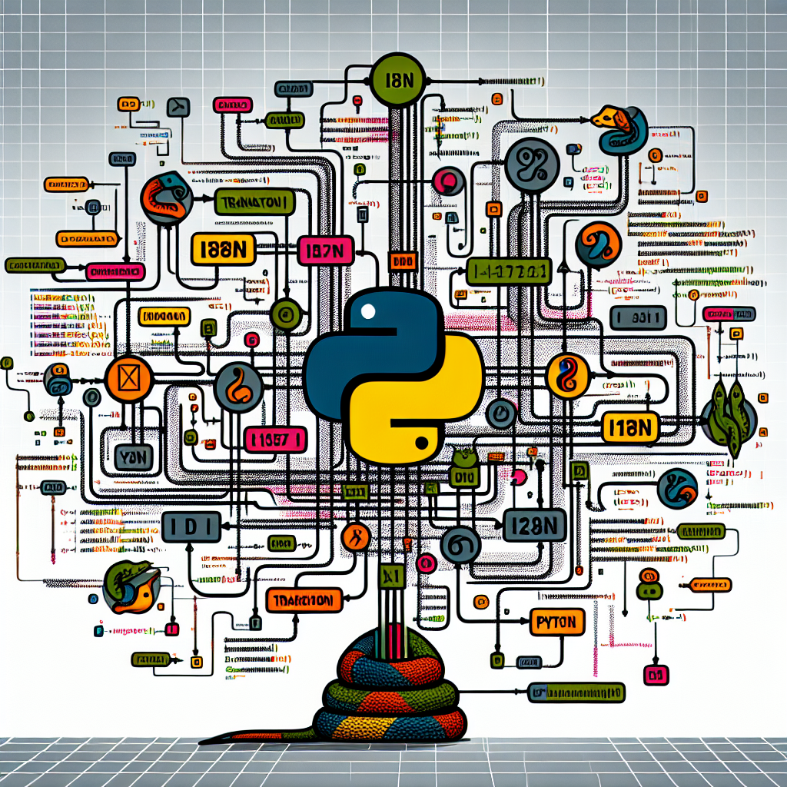

# 0x02-i18n

 In today's interconnected world, catering to users from different linguistic backgrounds is essential. Backend Python provides robust i18n (internationalization) capabilities, enabling developers to create multilingual applications seamlessly. 

<ul>
  <li>
    i18n Simplified: Backend Python's i18n modules, like gettext and Babel, offer simple yet powerful tools to handle translations. With minimal setup, developers can extract translatable strings, create translation catalogs, and seamlessly integrate them into their codebase
  </li>
    <li>
    A World of Languages: Backend Python's i18n empowers developers to support multiple languages effortlessly. By providing translations for UI elements, error messages, and content, applications can deliver a personalized experience that breaks language barriers.

  </li>
    <li>
    Adapting to Local Context: i18n in Backend Python goes beyond translating strings. It allows developers to adapt applications to local contexts, including date and time formats, number representations, and cultural conventions, ensuring a truly immersive user experience.
  </li>
    <li>
    Streamlined Maintenance: Backend Python's i18n tools make managing translations a breeze. Developers can update and add new translations without modifying the codebase, facilitating smoother collaboration and reducing the maintenance overhead.
  </li>
    <li>
    Global Impact: By embracing i18n in Backend Python, developers can make their applications accessible to a global audience. Empowering users to interact with software in their native language fosters inclusivity, enhances user satisfaction, and opens doors to new markets.
  </li>
</ul>
