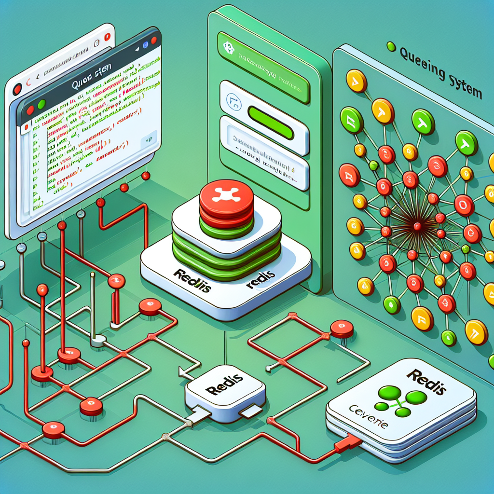

# Queuing System in JavaScript with Redis

## Queuing Systems

A **queuing system** is a data structure that manages tasks in a specific order, typically following the First-In-First-Out (FIFO) principle. Queues are essential in web applications for handling background jobs, message processing, and asynchronous operations. 

## Redis as a Queuing System

**Redis** is an in-memory data structure store that functions as a database, cache, and message broker. It supports various data types, with lists being particularly useful for implementing queues. 



### Key Redis Commands for Queues:
- **Add to Queue**: `RPUSH queue_name item`
- **Remove from Queue**: `LPOP queue_name`

These commands allow multiple producers to add items to the queue while multiple consumers can process them, making Redis an efficient tool for building scalable applications.

## Redis Client Interface

To interact with Redis from a Node.js application, a Redis client library is necessary. The client provides an interface for executing Redis commands and managing connections. The two most popular Redis clients for Node.js are **node-redis** and **ioredis**. 

### Client Features:
- Connect to the Redis server
- Execute commands (e.g., `get`, `set`, `lpush`, `lpop`)
- Handle errors and connection events

## Redis Client for Node.js

The **node-redis** client is widely used for integrating Redis with Node.js applications. It offers a simple API for executing Redis commands and managing connections, supporting both callbacks and promises for flexibility.

### Installation

To install the node-redis client, run:

```bash
npm install redis
```

### Resources:

<ul>
  <li>
    <a href="https://redis.io/docs/latest/integrate/">Redis quick start</a>
  </li>
  <li>
    <a href="https://redis.io/docs/latest/develop/connect/cli/">Redis client interface</a>
  </li>
  <li>
    <a href="https://github.com/redis/node-redis">Redis client for Node JS</a>
  </li>
  <li>
    <a href="https://github.com/Automattic/kue">Kue</a>deprecated but still use in the industry
  </li>
</ul>
